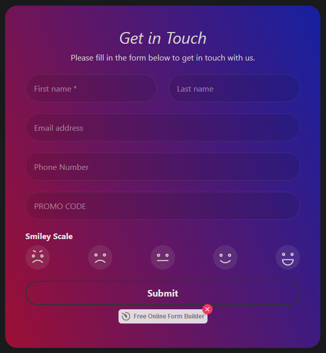

# Task 1

## Requirements

- [✅] Add header and subheader of the form. Align by center.
- [✅] Make "First Name" a necessary field. Width 50%.
- [✅] Make "Surname" field 50% width.
- [✅] "Email address" & "Phone Number" 100% width.
- [✅] "Promocode" field 100% width. The text and placeholder must always be in uppercase.
- [✅] Create "Smiley Scale" field with 5 different variants, 100% width. On variant hover, it must smoothly turn 45 degree right.
- [✅] Make "Submit" button 100% width and make it outlined.
- [✅] Make the background gradient.
- [✅] The form error color must be blue.
- [✅] Make the `border-radius: 40px`.
- [✅] Call the widget `Elfsight Test FB` → Publish → Plan "Lite"

### Result

```html
<script
  src="https://static.elfsight.com/platform/platform.js"
  data-use-service-core
  defer
></script>
<div
  class="elfsight-app-ef76a055-af05-4b66-b36d-58a76ea6920d"
  data-elfsight-app-lazy
></div>
```


