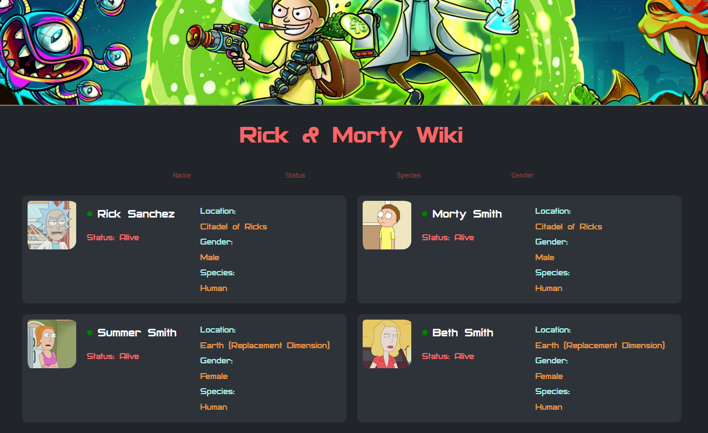

# Task 3 - Elfsight



```
Stack:
- React.js
- Typescript
- Axios
- Styled-Components
- Rick and Morty API
```

## Requirements

- Smooth navigation through characters and all the info API provides.
- Ability to filter characters by their: status, species, gender, etc...
- The filters must be available to combine.
- Use must be able to open a popup, by clicking on the character card.
- Using "ready component" packages **are prohibited**!

## Installation

Clone the repository:

```
git clone https://github.com/worldspawn-web/elfsight-task.git
```

Open the `task3` folder and install all required dependencies:

```
cd task3
npm ci
```

Run the website in development mode:

```
npm run dev

// Open the printed in console url:
// => http://localhost:5173/
```
