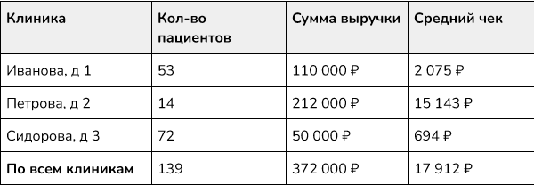
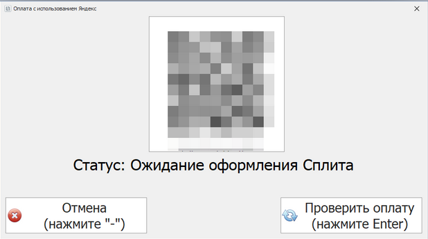

# Тестовые задания (QA-менеджер)

## 1. Тестирование мобильного приложения

Для выполнения задания нужно установить мобильное приложение
“Мой Зубной”.

**Ваша задача**: Провести blackbox-тестирование и зафиксировать все обнаруженные недочеты / ошибки.

**Дополнительное задание**: Предложить улучшение страницы или раздела приложения. Ваш выбор должен быть обоснован (например, количеством пользователей, которые взаимодействуют с этим функционалом). Предложение нужно подкрепить макетом (допускается использование любого графического редактора).

## 2. Поиск логической ошибки

Разработчик создал отчет по выручке клиник за Сентябрь и передал его Вам на проверку. Найдите логическую ошибку в отчете.

## 3. Поиск ошибки дизайна

Мы внедряем оплату с использованием сервиса Яндекс.Сплит. В связи с этим, на кассе в клинике добавляется новый способ оплаты - рассрочка через Яндекс.Сплит.

Оплату услуг производят врач с пациентом. Для оплаты через Яндекс.Сплит врач нажимает на кнопку “оплатить через Сплит” и попадает на следующий экран:

Для оплаты пациент должен отсканировать появившийся на экране QR-код (на картинке он заблюрен), а после этого оформить сплит на своем телефоне.

**Ваша задача**: Указать на ошибки, которые допустил разработчик в проектировании этого окошка и предложить способ их исправления.

P.S.: Управление оплатой происходит <u>только</u> через NumPad-клавиатуру кассового терминала.

## 4. Навыки работы с данными (Excel/Google Sheets)

Руководитель попросил подготовить годовой отчет по количеству новых пациентов за 2022 год. Вы попросили неопытного разработчика предоставить вам нужные данные.

Данные, подготовленные разработчиком, оказались достоверными, но не лучшего качества, а времени на их очистку у разработчика нет. Выход один - придется очищать данные самостоятельно.

Скачайте или импортируйте в Google Sheets документ с исходными данными по ссылке и выполните задания 1-5, указанные на первой странице файла.

https://docs.google.com/spreadsheets/d/1-304UViHtt4taGYCG3bdNABP22V3Axa9/edit?usp=sharing&ouid=102276795683048461858&rtpof=true&sd=true

## Критерии оценки

- Правильность решения задания
- Обоснование решения задания
- Аккуратность оформления решения
- Скорость выполнения задания
